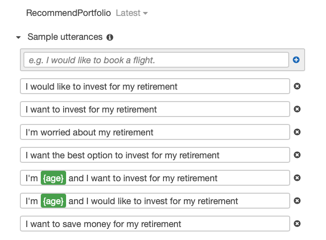
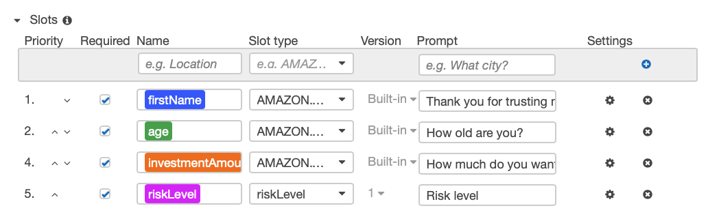
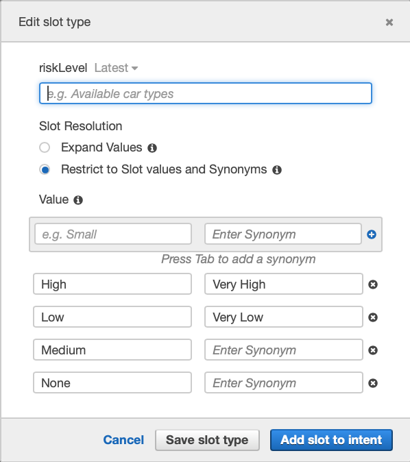
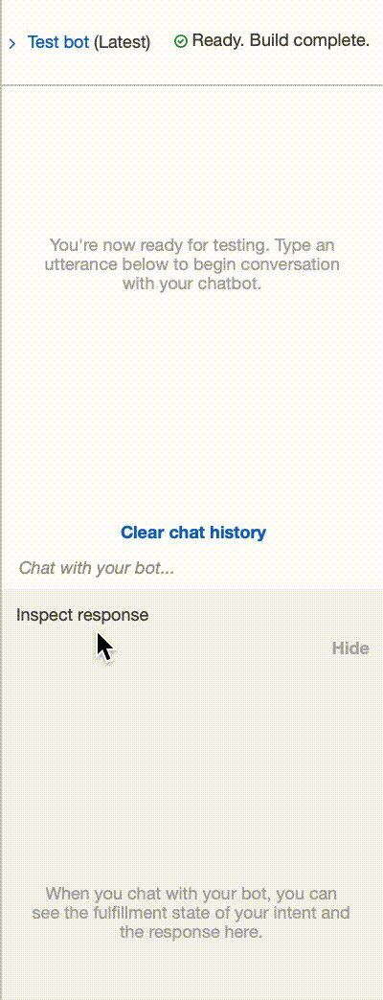
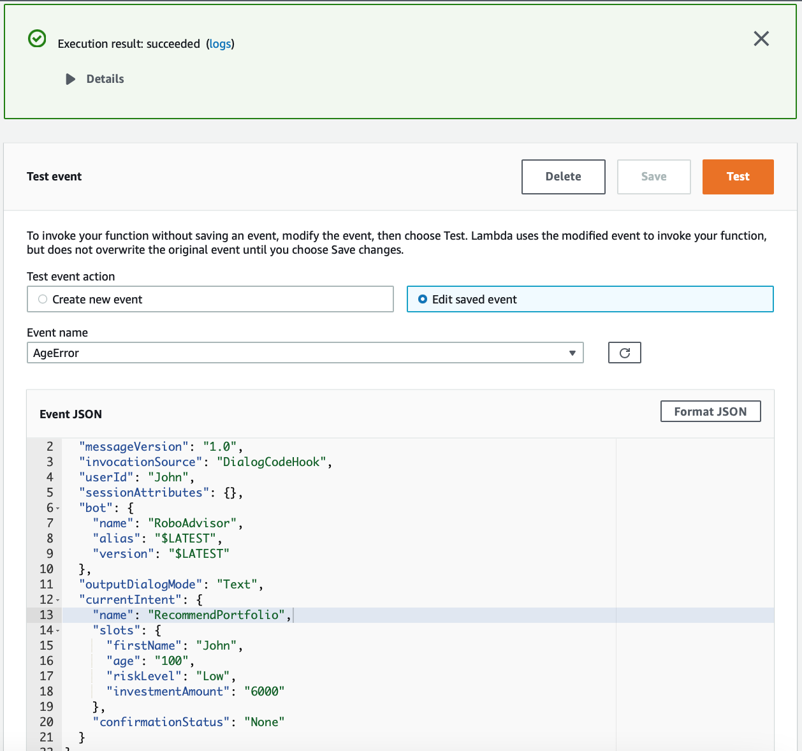
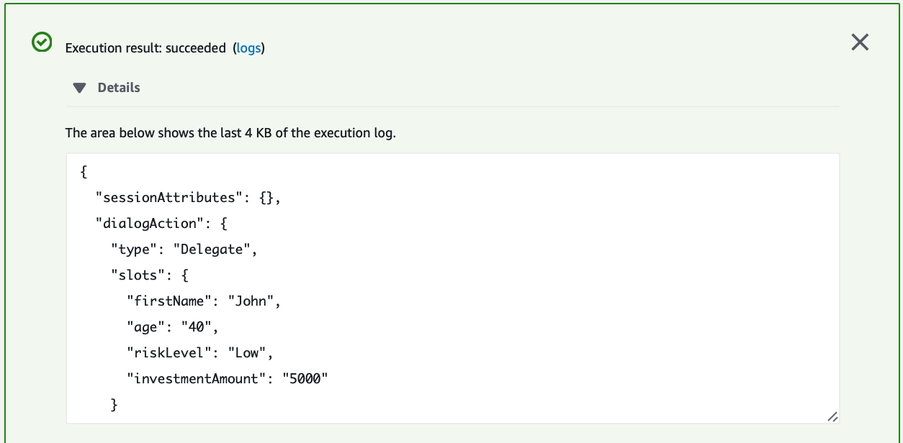
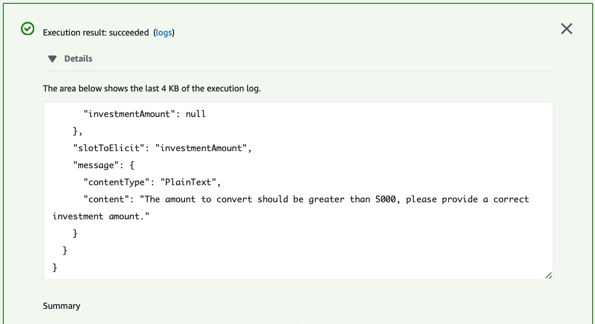
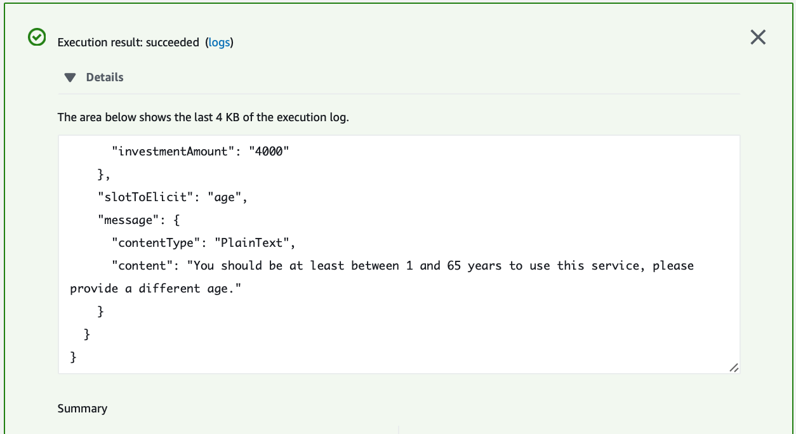
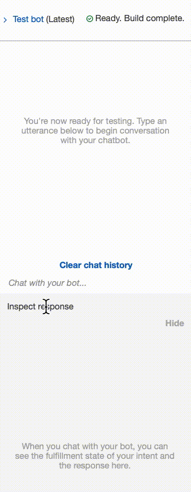

# aws-lex

## Table of Contents

<ol>
<li>
Robo Advisor for Retirement Plans
</li>
<li>
Data Preprocessing
</li>
<li>
Reducing Data Dimentions Using PCA
</li>
<li>
Clustering Cryptocurrencies Using K-Means
</li>
<li>
Visualizing Results
</li>
<li>
Optional Challenge
</li>
</ol>

**Files:** [Lambda Function](./RoboAdvisor/lambda_function.py)

## Robo Advisor for Retirement Plans

- In this homework assignment, I will combine my new Amazon Web Services skills with my already mastered Python superpowers, to create a bot that will recommend an investment portfolio for a retirement plan.

- I am asked to accomplish the following main tasks:

    - **[Initial Robo Advisor Configuration:](#Initial-Robo-Advisor-Configuration)** Define an Amazon Lex bot with a single intent that establishes a conversation about the requirements to suggest an investment portfolio for retirement.

    - **[Build and Test the Robo Advisor](#Build-and-Test-the-Robo-Advisor):** Make sure that my bot is working and responding accurately along with the conversation with the user, by building and testing it.

    - **[Enhance the Robo Advisor with an Amazon Lambda Function:](#Enhance-the-Robo-Advisor-with-an-Amazon-Lambda-Function)** Create an Amazon Lambda function that validates the user's input and returns the investment portfolio recommendation. This task includes testing the Amazon Lambda function and making the integration with the bot.

## Initial Robo Advisor Configuration

- [x] Sign in into your AWS Management Console and [create a new custom Amazon Lex bot](https://console.aws.amazon.com/lex/home). Use the following parameters:

    - **Bot name:** RoboAdvisor
    - **Output voice**: Salli
    - **Session timeout:** 5 minutes
    - **Sentiment analysis:** No
    - **COPPA**: No
    - **Advanced options**: No
    - _Leave default values for all other options._

- [x] Create the `RecommendPortfolio` intent, and configure some sample utterances as follows (you can add more utterances as you wish):

    - I want to save money for my retirement
    - I'm ​`{age}​` and I would like to invest for my retirement
    - I'm `​{age}​` and I want to invest for my retirement
    - I want the best option to invest for my retirement
    - I'm worried about my retirement
    - I want to invest for my retirement
    - I would like to invest for my retirement

- [x] This bot will use four slots, three using built-in types and one custom slot named `riskLevel`. Define the three initial slots as follows:

- [x] The `riskLevel` custom slot will be used to retrieve the risk level the user is willing to take on the investment portfolio. Create this custom slot as follows:

- [x] Select the `+` icon next to 'Slot Types' in the 'Editor' on the left side of the screen.

- [x] Choose `create custom slot` from the resulting display window.
- [x] For **Slot type name**, type: riskLevel
- [x] Select the radial dial button next to **Restrict to Slot values and synonyms**, then fill in the appropriate values and synonums. _Example_: Low, Minimal; High, Maximum.

- [x] Click `Add slot to intent` when finished.

- [x] Next, input the following data in the resulting display window:

    - **Prompt:** What level of investment risk would you like to take?
    - **Maximum number of retries:** 2
    - **Prompt response cards:** 4

- [x] Configure the response cards for the `riskLevel` slot as is shown bellow:

    **Note:** You can download free icons from [this website](https://www.iconfinder.com/) or you can use the icons provided in the [`Icons` directory](Icons/).

- [x] Move to the _Confirmation Prompt_ section, and set the following messages:

- **Confirm:** Would you like me to search for the best investment portfolio for you now?
- **Cancel:** I will be pleased to assist you in the future.

- [x] Leave the error handling configuration for the `RecommendPortfolio` bot with the default values.

## Build and Test the Robo Advisor
In this section, you will test your Robo Advisor. 
- [x] To build your bot, click on the `Build` button in the upper right hand corner. 
- [x] Once the build is complete, test it in the chatbot window. 
- [x] You should see a conversation like the one below.

## Enhance the Robo Advisor with an Amazon Lambda Function

- [x] In this section, you will create an Amazon Lambda function that will validate the data provided by the user on the Robo Advisor. Start by creating a new lambda function from scratch and name it `recommendPortfolio`. Select Python 3.7 as runtime.

- [x] In the Lambda function, start by deleting the AWS generated default lines of code, then paste in the starter code provided in [lambda_function.py](./RoboAdvisor/lambda_function.py) and complete the `recommend_portfolio()` function by following these guidelines:
    - User Input Validation

        - [x] The `age` should be greater than zero and less than 65.
        - [x] the `investment_amount` should be equal to or greater than 5000.

    - Investment Portfolio Recommendation

        - [x] Once the intent is fulfilled, the bot should response with an investment recommendation based on the selected risk level as follows:
            - **none:** "100% bonds (AGG), 0% equities (SPY)"
            - **very low:** "80% bonds (AGG), 20% equities (SPY)"
            - **low:** "60% bonds (AGG), 40% equities (SPY)"
            - **medium:** "40% bonds (AGG), 60% equities (SPY)"
            - **high:** "20% bonds (AGG), 80% equities (SPY)"
            - **very high:** "0% bonds (AGG), 100% equities (SPY)"

    - [x] Be creative while coding your solution, you can have all the code on the `recommend_portfolio()` function, or you can split the functionality across different functions, put your Python coding skills in action!

- [x] Once you finish coding your lambda function, test it using the sample test cases.

    

    

    

    

- [x] After successfully testing your code, open the Amazon Lex Console and navigate to the `RecommendPortfolio` bot configuration, integrate your new lambda function by selecting it in the _Lambda initialization and validation_ and _Fulfillment_ sections. Build your bot, and you should have a conversation as follows.

    